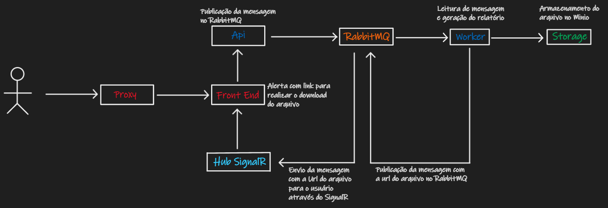

# Relatório

Repositório de exemplo de estudo com fluxo de geração de relatório de forma assíncrona utilizando mensageria para processamento e armazenamento dos arquivo em segundo plano e notificação no front end com link para download.

    

## Comandos

- docker compose up

## Portas

- Front End - [http://localhost:3000](http://localhost:3000)
- Back End - [http://localhost:81](http://localhost:81)
- Hub SignalR - [http://localhost:82](http://localhost:82)
- RabbitMQ Management - [http://localhost:15672](http://localhost:15672)
- RabbitMQ - [http://localhost:5672](http://localhost:5672)
- Minio Console - [http://localhost:9001](http://localhost:9001)
- Minio Api - [http://localhost:9000](http://localhost:9000)
